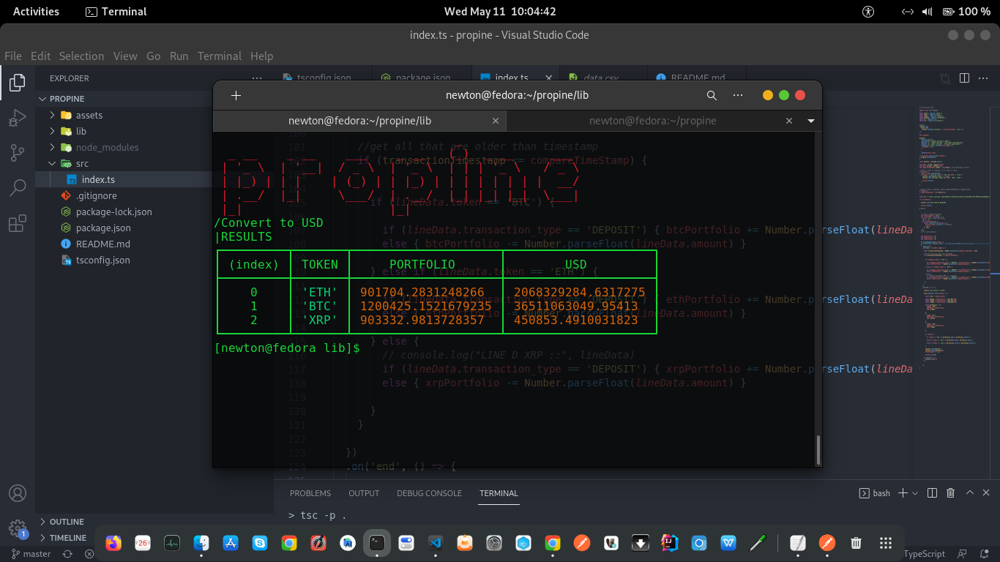

# Propine Potifolio Viewer

This commandline application is used to read a csv file containing transactions, and calculate the portifolio value in USD.

# Usage

#### `node index.js data.csv`

return the latest portfolio value per token in USD

#### `node index.js -t <token> data.csv`

return the latest portfolio value for the provided token in USD e.g `node index.js -t BTC data.csv`

#### `node index.js -d <yyyy/mm/dd> data.csv`

return the portfolio value per token in USD on the given date

#### `node index.js -t <token> -d <yyyy/mm/dd> data.csv`

 return the portfolio value of provided token in USD on the given date

# Working

[Commander](https://www.npmjs.com/package/commander) is used for parsing the command-line arguments into options and command-arguments, displaying usage errors for problems, and implementing a help system.

Node's `fs` is used to read the file, specifically using `fs.createReadStream()` which reads data in specified size of chucks i.e `bufferSize`. It's set to 100MB in the code (can be increased for faster read, depending on available memory). This is more memory efficient, and faster than `fs.readFile()` which loads the whole file into memory, taking into account that the file to be read is quite large.

For each chuck of data read, it's piped through `csv()` parser which outputs a javascript object representation for each line. 

The portiforlio value is calculated by adding deposits and substracting withdrawals, 
Finally, the USD Value is queried from [cryptocompare.com](https://cryptocompare.com/) API 

# Screenshot
